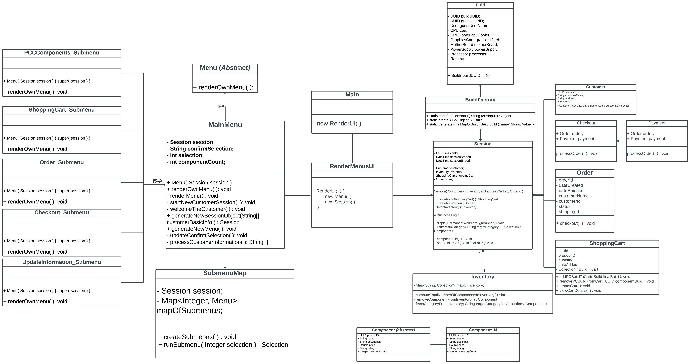

# PC Builder

## Project Description

A standalone Java program that allows a Customer to custom build a personal PC from an existing 
inventory of PC Components. 

### User Story

#### Minimym Viable Product (MVP)

As a guest customer I would like to navigate to the Main Menu from any Submen.
As a guest customer I want to be able to see my current build progress and current price of each component.
As a guest customer I want to be able to update my customer information.
As a guest customer I want to be able to add my build to my shopping cart.
As a guest customer I want to be able to view the items in my shopping cart.
As a guest customer I want to be able to remove a build from my shopping cart.
As a Customer I would like to be able to view and confirm my Order details in my current Session
As a guest Customer I would like to exit my current Session from the Main Menu
As a guest Customer I would like to add and update Payment Information
As a guest Customer I would like to navigate to a Submenu where I can update my previous name and email

#### Types of Customer
- Guest Customer - can only initiate a session
    - name
    - phone
    - email
    - session id (uuid)
- Registered Customer
#### Shopping Cart Feature
    - view
    - edit/update
    - clear
    - save
#### Stretch Goals

- Pre-built PC
    - Gaming
    - Business
    - Designer
    - HighEnd
- Name the PC Build
- Persist Inventory and User in DB
- User Class
    - have different types of customers

### PC Build 

    - Terminal/CommandLine: Guided Walk Through 
        
            STEP 0 : GREET AND PROCESS NEW CUSTOMER
                - get customer info
                - create new session for guest customer
                    - create new customer
                    - fetch current inventory
            
            STEP 1 : RENDER CURRENT BUILD
                - display permanent walk through banner to customer
                    - shows current build
                    - DECIDE: shows current total price

            STEP 2 : DISPLAY PC COMPONENT
                - customer selects subsequent components
                    - display live inventoy list of current component
                        - Example: if component is a processor
                                *******************************************************
                                insructions: select component

                                select    component      price    rating        des
                                  1      Processor A   $ double     *       lorem ipsum
                                  2      Processor B   $ double     *       lorem ipsum
                                  3      Processor C   $ double     *       lorem ipsum
                                *******************************************************
                    - capture customer input ( integer value )

            STEP 3 BUILD (complete)
                - message customer of successful build
                - display current build

            STEP 4 - SHOPPING CART
                - create shopping cart
                - prompt customer to: 
                    - add build to cart
                    - remove build from cart
                    - view shopping cart

            STEP 5 : ORDER      
                - create new order
                - display order to customer
                    - order meta data (order id, timestamp)
                    - display component price
                    - display total price
                    - display total price after tax
                - prompt customer to:
                    - return to cart ( display cart )
                    - proceed to payment

            STEP 6 : PAYMENT
                - prompt customer to select payment type
                    - crypto, credit/debit, paypal, IOU...

### PC Builder MVP UML

### PC Builder Slide Show